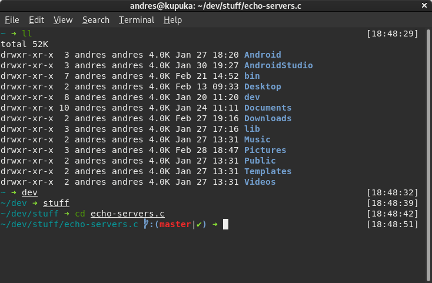

# chinipage.zsh-theme

A minimalist ZSH theme with git support

## Compatibility

This theme requires:
- [git-prompt](https://github.com/ohmyzsh/ohmyzsh/tree/master/plugins/git-prompt) plugin (which requires python).
- [Powerline Fonts](https://github.com/powerline/fonts).

## What does it show?

- If the previous command succedded or failed (green or red arrow)
- Git status
  - Current branch / SHA1 if detached head state
  - Dirty working directory (✘)
- Working directory
- Time at which control was returned to the user
- Last command duration

