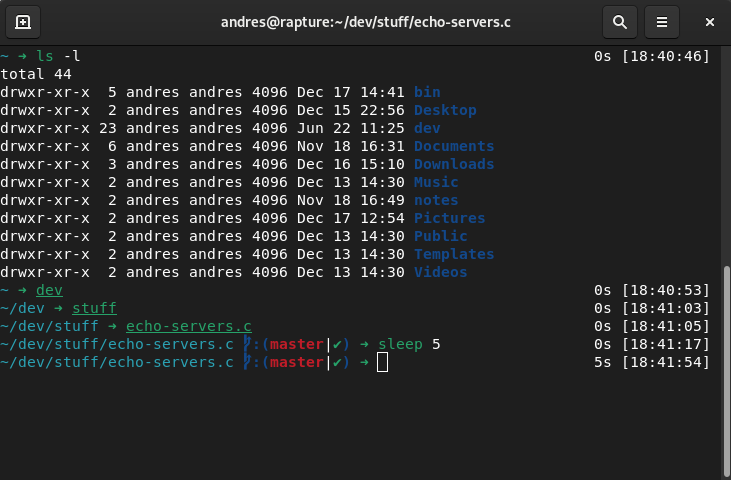

# chinipage.zsh-theme

A ZSH minimalist theme with git support

# Compatibility

You will need to have activated the `git-prompt` plugin.

## What does it show?

- If the previous command failed (red arrow)
- Git status
  - Current branch / SHA1 in detached head state
  - Dirty working directory (✘)
- Working directory
- Time at which control was returned to the user

